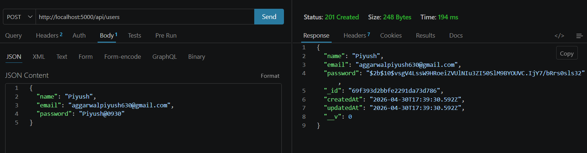
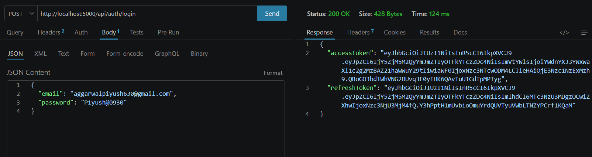
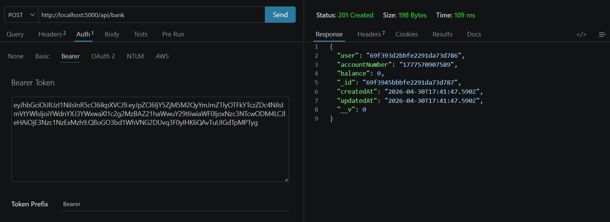
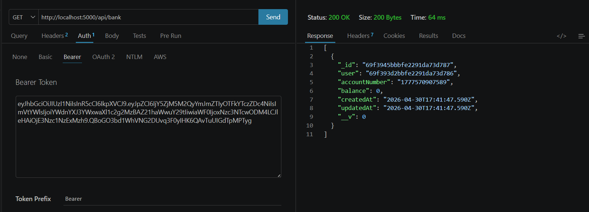
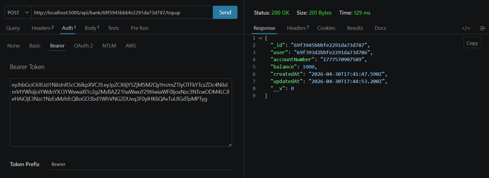

# LeadMax Payment Backend System

This project demonstrates real-world API design, authentication, and payment handling logic suitable for fintech systems.

A production-ready backend system built with **Node.js, Express, and MongoDB** to simulate a digital payment platform with user management, authentication, bank accounts, and transaction handling.

---

## Features

### User Management

* Create User
* Update User
* Delete User
* Get User Profile
* Get Users List

### Authentication

* Login with JWT
* Access Token (expires in 5 minutes)
* Refresh Token (expires in 1 day)

### Bank Account System

* Add Bank Account (Max 3 per user)
* Get User Bank Accounts
* Delete Bank Account
* Top-up Account Balance

### Payment System

* Transfer money between accounts
* Automatic success & failure handling
* Transaction history tracking

---

## Tech Stack

* Node.js
* Express.js
* MongoDB Atlas
* Mongoose
* JWT (jsonwebtoken)
* bcrypt.js

---

## Project Structure

```
leadmax-payment-system/
│
├── src/
│   ├── config/
│   ├── controllers/
│   ├── middlewares/
│   ├── models/
│   ├── routes/
│   ├── utils/
│   ├── assets/   
│   └── app.js
│
├── server.js
├── .env
├── package.json
```

---

## Setup Instructions

### 1. Clone the Repository

```
git clone <your-repo-url>
cd leadmax-payment-system
```

---

### 2. Install Dependencies

```
npm install
```

---

### 3. Setup Environment Variables

Create a `.env` file in the root directory:

```
PORT=5000
MONGO_URI=your_mongodb_atlas_uri

JWT_ACCESS_SECRET=access_secret_key
JWT_REFRESH_SECRET=refresh_secret_key
```

---

### 4. Run the Server

```
npm run dev
```

Server will start at:

```
http://localhost:5000
```

---

## API Endpoints

### User APIs

| Method | Endpoint       |
| ------ | -------------- |
| POST   | /api/users     |
| GET    | /api/users     |
| GET    | /api/users/:id |
| PUT    | /api/users/:id |
| DELETE | /api/users/:id |

---

### Authentication APIs

| Method | Endpoint          |
| ------ | ----------------- |
| POST   | /api/auth/login   |
| POST   | /api/auth/refresh |

---

### Bank Account APIs

| Method | Endpoint            |
| ------ | ------------------- |
| POST   | /api/bank           |
| GET    | /api/bank           |
| DELETE | /api/bank/:id       |
| POST   | /api/bank/:id/topup |

---

### Payment APIs

| Method | Endpoint     |
| ------ | ------------ |
| POST   | /api/payment |
| GET    | /api/payment |

---

## Screenshots (API Testing)

### Create User



---

### Login (Access + Refresh Tokens)



---

### Add Bank Account



---

### Get Bank Accounts



---

### Top-up Balance



---

## Security Features

* Password hashing using bcrypt
* JWT-based authentication (Access + Refresh tokens)
* Protected routes using middleware
* Ownership validation for bank accounts
* Maximum 3 bank accounts per user
* Centralized error handling middleware

---

## Limitations

* No MongoDB transactions (can be improved using sessions)
* No rate limiting
* No input validation layer

---

## Future Improvements

* MongoDB Transactions (Atomic Payments)
* Rate Limiting
* Swagger Documentation
* Docker Deployment
* Redis Caching

---

## Testing

Use Postman or Thunder Client.

Include:

```
Authorization: Bearer <accessToken>
```

for protected routes.

---

## Author

Piyush Aggarwal

---

## Conclusion

This project showcases a scalable backend architecture with authentication, banking logic, and transaction processing, closely resembling real-world fintech backend systems.
